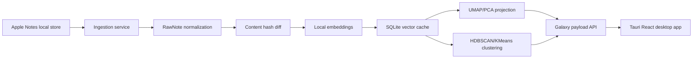

# NeuralNotes Architecture

## Data Flow

## Frontend

- `App.tsx` owns high-level modes, search, sync, and selected note state.
- `GalaxyView.tsx` renders nodes, cluster halos, labels, pan/zoom, hover previews, and graph edges.
- `InsightPanel.tsx` surfaces local lightweight analysis.
- `TimelineScrubber.tsx` drives time-evolution mode.
- `NotePreview.tsx` provides the floating note detail panel.

## Backend

- `apple_notes.py`: layered local ingestion.
- `embeddings.py`: sentence-transformers embeddings with hashing fallback.
- `clustering.py`: projection, clustering, nearest-neighbor edges, memory scoring.
- `database.py`: SQLite cache and API payload shape.
- `indexer.py`: incremental indexing orchestration.

## Future Hardening

- Store embedding dimensions and model metadata in a migration table.
- Add WAL-safe snapshot copying before parsing large Apple Notes libraries.
- Move long indexing jobs to a queue with progress events.
- Stream graph chunks to the frontend for 10k+ notes.
- Add Tauri commands to supervise the Python service lifecycle.
